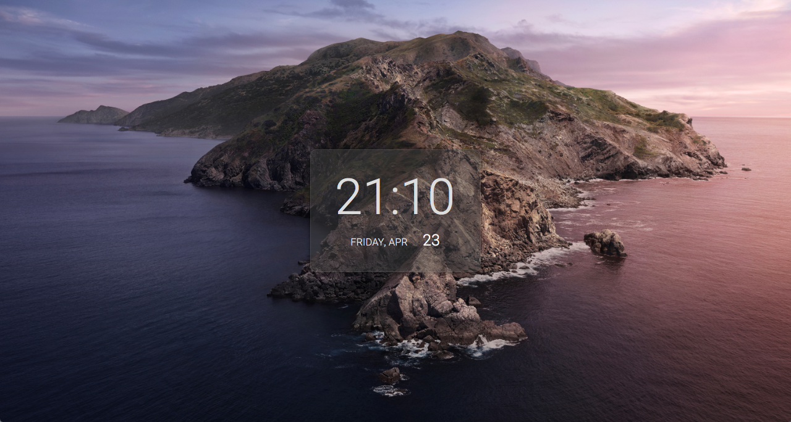

# Safari Homepage

Safari Homepage is a free simple slideshow page with time and date.

https://krisbaranski.github.io/safari_homepage/

HTML5, CSS and JS-powered.

- There are 5 images in the HTML file and 'img/' folder, you can change them as you like
- You can also manipulate slideshow timer in JS file (now setInterval to 12000ms)
- I kept seconds for the clock as a comment

